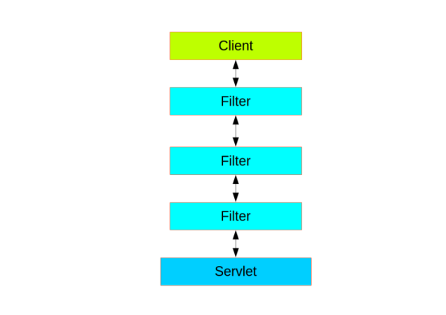
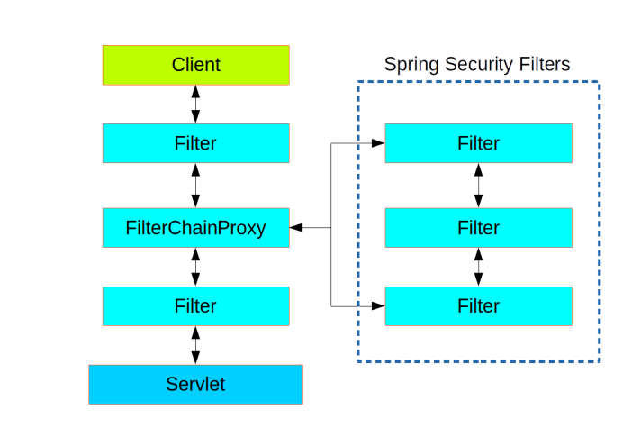

# Spring Security Basic Practice
Spring Security는 인증(Authentication) 및 인가(Authorization)를 담당하는 스프링 프레임워크이다. 본 블로깅에서는 Spring Security의 기초 개념을 공부하고 실습한다.
* 버전 : Spring Boot 3.0 / Spring Security 6.0 버전

## Basic Web Security


Servlet 기반으로 구동되는 웹서비스는 인증, 인가, 변환, 압축, 암호화 등 비즈니스 로직이 수행되기 전에 공통으로 사용되는 로직을 Servlet Filter로 구현한다.
위 그림처럼 Servlet이 웹 요청을 처리하기 앞서 여러 Filter가 순서에 맞춰 수행되는 것이 Servlet 서버의 기본 동작 흐름이다.

## Spring Security


Spring Security는 FilterChainProxy라는 물리 Filter 한 개를 필터 흐름에 끼워 넣는데, 이 프록시는 내부적으로 FilterChain이라는 Filter 복합체 여러개를 가지며 FilterChain 한 개는 많은 Filter를 가진다.  

```java
public interface SecurityFilterChain {
    boolean matches(HttpServletRequest request);
    List<Filter> getFilters();
}
```
FilterChainProxy는 가지고 있는 FilterChain 중 현재 웹 요청(HttpServletRequest)을 지원하는 첫 번째 chain을 선택하여 해당 chain의 Filter들을 수행한다. SecurityFilterChain interface의 matches 메서드를 이용해서다. 

개발자는 Spring Security에서 기본적으로 제공하는 FilterChain 리스트 외에 커스텀 FilterChain을 추가하여 서비스의 보안 요구사항을 만족시키는 작업을 해야한다.

## Thread Bounded Security Context
Servlet은 웹 요청마다 하나의 thread로 동작하는데, Spring Security에서도 thread 단위로 현재의 인증된 Principal(인증 주체)를 저장한다.
인증된 principal을 Authentication interface로 지칭하며 이 객체는 SecurityContext에 포함된다.

인증된 객체의 정보를 접근하는 방법은 3가지 정도 있다. 

1. SecurityContextHolder (흔히 쓰이지는 않음)
```java
SecurityContext context = SecurityContextHolder.getContext();
Authentication authentication = context.getAuthentication();
User = (User) authentication.getPrincipal();
```
2. @AuthenticationPrincipal
```java
@RequestMapping("/foo")
public String foo(@AuthenticationPrincipal User user) {
}
```
3. Principal
```java
@RequestMapping("/foo")
public String foo(Principal principal) {
    Authentication authentication = (Authentication) principal;
    User user = (User) authentication.getPrincipal();
}
```

## HttpSecurity 분석

## References
* Spring Security Architecture : https://spring.io/guides/topicals/spring-security-architecture

